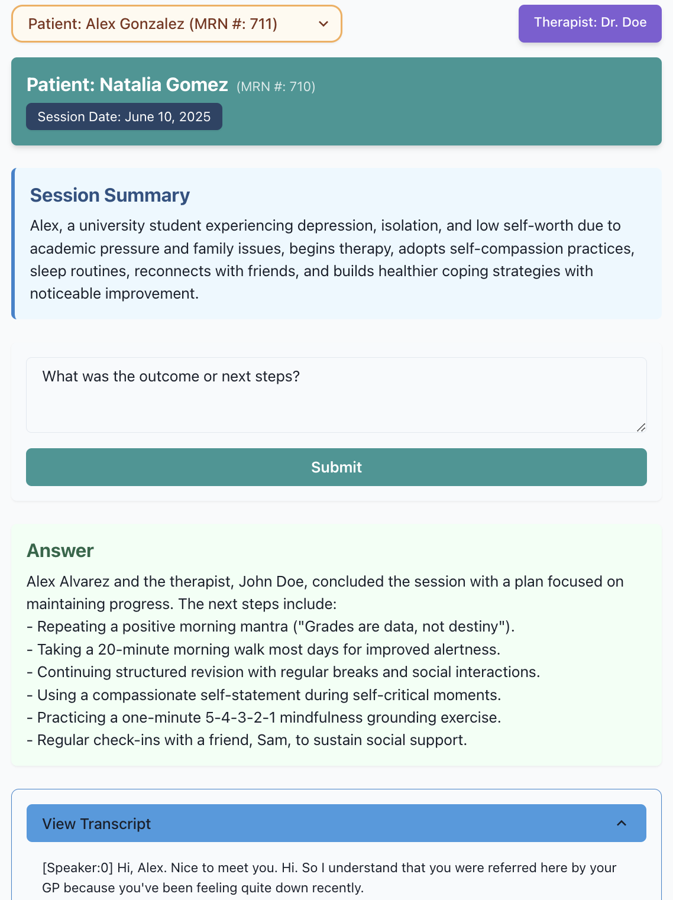

# Blueprint AI: Transcript Q&A Agent

<p align="center">
  
</p>

A question-answering agent integrated into a full-stack application for a work simulation exercise.

##### Key Highlights:

- The agent uses Redis to preserve context window across each call (critical for context aware responses if the therapist engages in multi-turn Q&A)
- The agent uses Langchain to chunk + summarize transcript content if it passes a certain token threshold (8k+)
- LLM evaluation + refinement was done via OpenAi evals
- Helicone is used for (future) production-ready observability + performance monitoring/cost optimization

#### Future Improvements:

- **More in-depth LLM eval**: The agent was run through OpenAI's Eval framework (see `/llm-evals`) to get some quick wins in the prompting. However, LLM evals just take _a lot_ more time to do well - the best ones still require manual annotation on dev, training, and validation sets (typically that task alone takes ~3 hours). If there was more time, this would be the highest priority for shipping a production-grade, HIPAA compliant Q&A agent.
- **RAG** approach (instead of LangChain summarization): Normally, any content under <50k does not need RAG. A typical transcript (plus the forced "context window" added here for previous Q&As) for a 1-hour session does not normally exceed ~8-9k tokens, which is the reason a more simple Langchain chunk + summary was used here.
- **UI Design**: Self-explanatory once you run the app !\_!

## Project Structure

- `/api` - Backend Node.js application
- `/client` - Frontend React application
- `/llm-evals` - LLM evaluation via OpenAI Evals (includes eval rubric, metrics, and sample outputs)
- `/api/data` - Contains the transcript file **PLUS** an extended version with more words (tokens) to test chunking LLM calls

## Setup

1. Under the root directory, create your .env file and populate with the following:

   ```
   OPENAI_API_KEY={YOUR_OPENAI_API_KEY}
   HELICONE_API_KEY={YOUR_HELICONE_API_KEY}
   DATABASE_URL=postgres://postgres:postgres@db:5432/appdb
   AGENT_URL=http://localhost:3000/agent/transcript/question
   MAX_SUMMARY_TOKENS=6000
   AGENT_LLM=gpt-4-turbo
   SUMMARIZER_LLM=gpt-4.1
   ```

   Alternatively, if you don't have a [Helicone](https://us.helicone.ai/prompts) account, you can remove its integration in agent.service.ts and langchain.service.ts

2. From the root of the project, start the application:

   ```bash
   docker compose up --build
   ```

   Under the hood, this will:

   - Start up Redis first
   - Start DB,
   - Run the DB migrations
   - Run the loadTranscript.ts script to load the transcript into DB

3. In a new terminal, run the database migrations:
   ```bash
   docker compose run api npm run migration:up
   ```
4. In /api:

   ```
   docker compose run --rm api npx ts-node scripts/loadTranscript.ts
   ```

   This will load the transcript into the DB

5. Visit [localhost:5173](http://localhost:5173) to verify the application is running

## Frontend:

- **React** – JavaScript library for building user interfaces.
- **TypeScript** – Typed superset of JavaScript for safer, scalable code.
- **Vite** – Fast development server and bundler for modern web apps.
- **Chakra UI** – Accessible, composable component library.

## Backend:

This API is built with **NestJS**. Additional frameworks and libraries added include:

#### AI & Language Processing

- **LangChain** – Framework for building language model applications.
- **OpenAI SDK** Uses OpenAI's models for generating completions, embeddings, etc.
- **GPT-3 Encoder** – Tokenization utility for managing LLM input/output lengths, necessary for chunking + summarization.
- **OpenAI Evals** - LLM agent evals!
- **Helicone** - Observability for LLMs APIs that logs each call + provides analysis (great for improving LLM efficiency/cost tradeoffs)

#### Caching & Queuing

- **ioredis** – Redis client to store questions and answers previously asked + "force" a context window (OpenAI does not keep context between API calls)

## Agent Evaluation:s

Our favorite part! LLM evaluation here's done with the [OpenAI Evals](https://platform.openai.com/docs/guides/evals) framework, and manual evaluation was done to improve the prompt (`AGENT_SYSTEM_PROMPT`).

**Note:** This app uses the OpenAI Evals framework to improve agent performance (see `/evals`). Fair warning: It is a pretty large package, so may take a while to install.

### Eval Installation:

Assuming virtual env is activated:

1. Retrieve your Open AI API key and export to shell:
   ```
   export OPENAI_API_KEY="{API_KEY_HERE}"
   ```
2. Under `/llm-evals/` :
   Clone the OpenAI Evals repo straight from Git:
   ```
   git clone https://github.com/openai/evals
   ```
3. Under the newly created `/llm-evals/evals`:

   ```
   mkdir registry
   cd registry
   mkdir evals
   ln -s ../../../therapy_questions.yaml therapist_agent_qa.yaml
   pip install -e . --no-deps
   pip install -r requirements.txt
   ```

   - The --no-deps flag is to bypass an occasional issue where installing Evals goes too far down the dependency nest

4. Under /llm-evals/evals:

   ```
   export PYTHONPATH="../:$PYTHONPATH"
   oaieval http_agent therapist_agent_qa --max_samples 25
   ```
